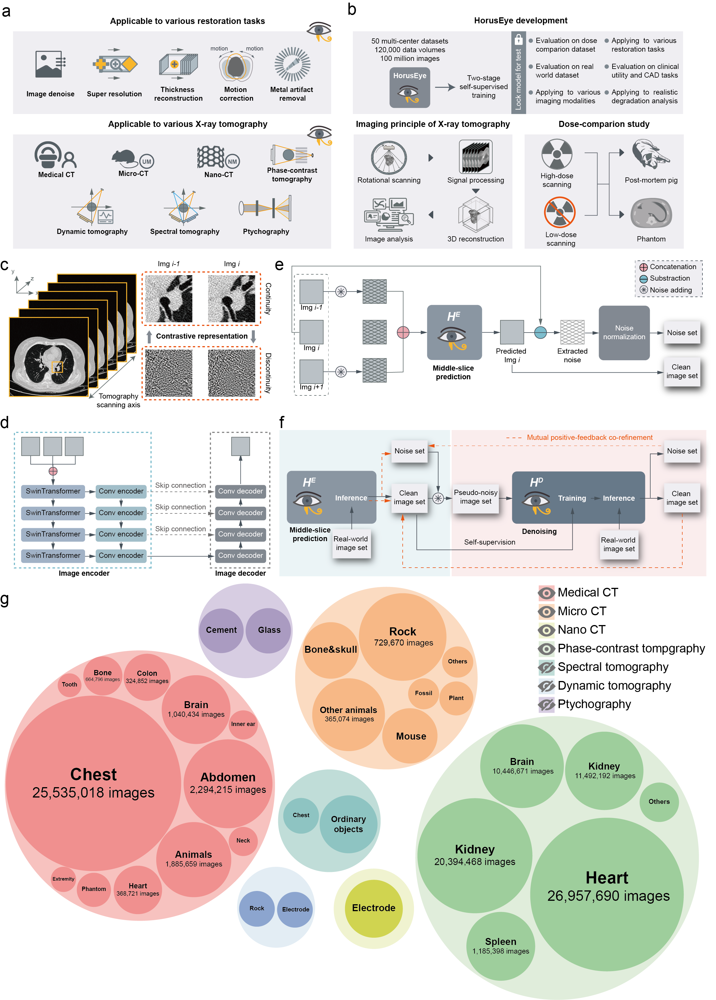

# HorusEye: Self-Supervised Foundation Model for X-ray CT Restoration

Official repository for **"HorusEye: A self-supervised foundation model for generalizable X-ray tomography restoration"**,
published in *Nature Computational Science* (2026).

**Authors:** Yuetan Chu, Longxi Zhou, Gongning Luo, Kai Kang, Suyu Dong, Zhongyi Han, Lianming Wu, Xianglin Meng, Changchun Yang, Xin Guo, Yuan Cheng, Yuan Qi, Xin Liu, Dexuan Xie, Ricardo Henao, Xigang Xiao, Shaodong Cao, Gianluca Setti, Zhaowen Qiu, and Xin Gao — *King Abdullah University of Science and Technology (KAUST)*

> **Paper:** [Nature Computational Science](https://www.nature.com/articles/s43588-026-00973-3) · **Manuscript PDF:** [Main text](Manuscript/Main_text.pdf) · [Supplementary](Manuscript/Supplementary_Information.pdf)

---

## Overview

HorusEye is a self-supervised CT restoration foundation model that requires **no paired clean/noisy training data**. It is pretrained on data from 50 multi-center datasets via a two-stage mutual co-refinement strategy and then fine-tuned for specific restoration tasks.

| Task | Fine-tuning script |
|---|---|
| Denoising (foundation) | `training_repro/pretrain_mutual.py` |
| Super-resolution (4×) | `training_repro/finetune_sr.py` |
| Metal artifact removal | `training_repro/finetune_metal.py` |
| Motion correction | `training_repro/finetune_motion.py` |
| Slice thickness reduction | `training_repro/finetune_thickness.py` |

<p align="center">
  
</p>

---

## Installation

### Requirements

| Package | Tested version |
|---|---|
| Python | 3.10 |
| PyTorch | 2.11 + CUDA 12.8 |
| MONAI | 1.5.1 |
| scikit-image | ≥ 0.21 |
| PyWavelets | ≥ 1.4 |

### Step 1 — Create conda environment

```bash
conda create -n HorusEye python=3.10
conda activate HorusEye
```

### Step 2 — Install PyTorch (CUDA 12.x)

```bash
conda install pytorch torchvision torchaudio pytorch-cuda=12.1 -c pytorch -c nvidia
```

### Step 3 — Install remaining dependencies

```bash
pip install monai==1.5.1
pip install pydicom==2.4.4
pip install scikit-image scipy opencv-python PyWavelets
```

### Step 4 (optional) — Model-based iterative reconstruction (MBIR)

Required only for `projection/` utilities:

```bash
conda install -c conda-forge odl
conda install -c astra-toolbox -c nvidia astra-toolbox
```

---

## Pretrained Checkpoint

A checkpoint trained on approximately 1 million images is available for download:

**[Download from Zenodo](https://zenodo.org/records/20446989)**

Place the downloaded file at any path and pass it to the inference or fine-tuning scripts via `--pretrain_ckpt`.

---

## Inference (Denoising)

```python
import numpy as np
from inference import predict_denoised_slice

# Load a 2D CT slice (float32, normalized to [0, 1], shape (512, 512))
img = np.load("example_dataset/000.npy")

# Run denoising (returns same shape)
restored = predict_denoised_slice(img, checkpoint_path="HorusEye.pth")
```

See [`inference.py`](inference.py) for the full API. Inference for a single 512×512 slice typically completes in under 5 seconds on a GPU.

### Evaluate results

```python
from analysis.evaluation import compare_img

psnr, ssim, nmse, nmae = compare_img(img_clean, img_restored)
print(f"PSNR: {psnr:.2f}  SSIM: {ssim:.4f}  NMSE: {nmse:.4f}")
```

---

## Training Reproduction

The `training_repro/` folder provides a complete, self-contained reproduction of the pretraining and fine-tuning pipeline from the paper. It requires only the 50 images in `example_dataset/` to run smoke tests.

### Pretraining — Two-Stage Mutual Co-Refinement

The paper's pretraining consists of two co-evolving networks:

**Stage 1 — Inter-slice prediction (noise extraction)**
Use two neighboring CT slices (z−1, z+1) to predict the middle slice z. Because noise is acquired independently per slice, the prediction residual `raw_z − predicted_z` is a self-supervised estimate of the real acquisition noise.

**Stage 2 — Denoising autoencoder**
Inject extracted noise into clean images to form synthetic noisy inputs. Train the main SwinUNet denoiser to recover the clean image.

**Iterative co-refinement loop (T iterations)**
```
for each iteration t:
  A. Train noise extractor on slice triplets
  B. Extract noise residuals → NoiseSampleBank
  C. Train denoiser with (CleanImageBank + NoiseSampleBank) pairs
  D. High-confidence denoiser outputs → update CleanImageBank
```

#### Run full pretraining

```bash
python -m training_repro.pretrain_mutual \
    --data_dir /path/to/ct_slices \
    --save_dir checkpoints/pretrain_mutual \
    --n_iterations 3 \
    --steps_per_phase 5000 \
    --batch_size 4 \
    --device cuda
```

#### Quick smoke test (uses only `example_dataset/`, takes ~30 s on CPU)

```bash
python -m training_repro.pretrain_mutual \
    --data_dir example_dataset \
    --save_dir /tmp/smoke_test \
    --n_iterations 1 \
    --steps_per_phase 5
```

Two checkpoints are saved:
- `noise_extractor.pth` — Stage-1 inter-slice prediction network
- `denoiser.pth` — Stage-2 main denoiser (use this for fine-tuning)

### Fine-tuning

All fine-tuning scripts load the pretrained denoiser, freeze the encoder, and train only the decoders and output head.

#### Super-resolution (4×)

```bash
python -m training_repro.finetune_sr \
    --data_dir /path/to/hr_slices \
    --pretrain_ckpt checkpoints/pretrain_mutual/denoiser.pth \
    --save_dir checkpoints/finetune_sr
```

#### Metal artifact removal

```bash
python -m training_repro.finetune_metal \
    --data_dir /path/to/metal_data \
    --pretrain_ckpt checkpoints/pretrain_mutual/denoiser.pth \
    --save_dir checkpoints/finetune_metal
```

#### Motion correction

```bash
python -m training_repro.finetune_motion \
    --data_dir /path/to/clean_slices \
    --pretrain_ckpt checkpoints/pretrain_mutual/denoiser.pth \
    --save_dir checkpoints/finetune_motion
```

#### Slice thickness reduction (5 mm → 1 mm)

```bash
python -m training_repro.finetune_thickness \
    --data_dir /path/to/thickness_data \
    --pretrain_ckpt checkpoints/pretrain_mutual/denoiser.pth \
    --save_dir checkpoints/finetune_thickness
```

### `training_repro/` module map

```
training_repro/
├── config.py               # ModelConfig / SmallModelConfig / TrainConfig
├── model.py                # SwinUNet (backbone + conv head; freeze_encoder())
├── losses.py               # ln_loss, sharp_loss, flow_loss, reconstruction_loss
├── noise_simulation.py     # Log-Poisson noise (image-space and sinogram-based)
├── inter_slice_dataset.py  # PseudoVolumeDataset / InterSliceVolumeDataset
├── noise_extractor.py      # NoiseExtractor (2-ch in) + extract_noise_bank()
├── dataset.py              # DenoiseDataset, SRDataset, MetalDataset, ...
├── trainer.py              # Generic Trainer base class (AMP, checkpoint, LR schedule)
├── mutual_refinement.py    # MutualRefinementPretrain — full co-refinement loop
├── pretrain_mutual.py      # CLI: full two-stage pretraining
├── pretrain_denoise.py     # CLI: simplified single-stage pretraining (synthetic noise)
├── finetune_sr.py          # CLI: super-resolution fine-tuning
├── finetune_metal.py       # CLI: metal artifact removal fine-tuning
├── finetune_motion.py      # CLI: motion correction fine-tuning
└── finetune_thickness.py   # CLI: slice thickness reduction fine-tuning
```

---

## Model-Based Denoising Baselines

Classical and zero-shot denoising methods are implemented in [`common_denoise.py`](common_denoise.py):

| Method | Function |
|---|---|
| Total Variation | `denoise_TV_img` |
| Bilateral filter | `denoise_bila_img` |
| Wavelet | `denoise_wave_img` |
| Non-local means | `denoise_NL_img` |
| Gaussian | `denoise_Gaussian_img` |
| BM3D | `denoise_bm3d_img` |
| Zero-Shot Noise2Noise | `denoise_zs_n2n_img` |
| Deep Image Prior | `denoise_DIP_img` |

Interactive notebook: [`Denoising_Illustration.ipynb`](Denoising_Illustration.ipynb)

---

## Model-Based Iterative Reconstruction (MBIR)

Sinogram-domain reconstruction methods are implemented in [`projection/`](projection/):

```python
from projection.utils import simulate_noisy_proj_astra, FBP_ASTRA, SIRT_ASTRA, TV_ODL

img = np.load("example_dataset/000.npy")
proj_geom, vol_geom, sinogram = simulate_noisy_proj_astra(img, noise=True, num_angles=270)

fbp     = FBP_ASTRA(proj_geom, vol_geom, sinogram)
sirt    = SIRT_ASTRA(proj_geom, vol_geom, sinogram, iterations=50)
tv_recon = TV_ODL(proj_geom, vol_geom, sinogram)
```

Requires `odl` and `astra-toolbox` (see installation step 4).

---

## SGM Baseline

We include the official SGM (score-based generative model) baseline from:

> **"Wavelet-improved score-based generative model for medical imaging"** — [Zenodo](https://zenodo.org/record/8266123)

Source code: [`SGM/`](SGM/). The SGM checkpoint should be downloaded separately from the link above.

```bash
cd SGM
python separate_ImageNet.py \
  --model ncsn \
  --runner Aapm_Runner_CTtest_10_noconv \
  --config aapm_10C.yml \
  --doc AapmCT_10C \
  --test \
  --image_folder output
```

---

## Example Dataset

`example_dataset/` contains 50 clean CT slices (`000.npy`–`049.npy`):
- Format: NumPy float32, shape `(512, 512)`
- Values normalized to `[0, 1]`
- Suitable for synthesizing noisy inputs and evaluating denoising

```python
import numpy as np
img = np.load("example_dataset/000.npy")   # shape (512, 512), dtype float32
```

Links to larger public datasets are listed in Supplementary Note 1 of the paper. A selection:

| Dataset | Link |
|---|---|
| PENET | [GitHub](https://github.com/marshuang80/PENet) |
| RSNA-PE | [RSNA](https://www.rsna.org/rsnai/ai-image-challenge/rsna-pe-detection-challenge-2020) |
| RAD ChestCT | [Duke CVIT](https://cvit.duke.edu/resource/rad-chestct-dataset/) |
| AbdomenCT-1K | [GitHub](https://github.com/JunMa11/AbdomenCT-1K) |
| DeepLesion | [NIH](https://nihcc.app.box.com/v/DeepLesion) |
| TomoBank | [tomobank.readthedocs.io](https://tomobank.readthedocs.io/) |

---

## Results

<p align="center">
  
</p>

<p align="center">
  
</p>

<p align="center">
  
</p>

---

## Acknowledgements

- [RED-CNN](https://github.com/SSinyu/RED-CNN)
- [CTformer](https://github.com/wdayang/CTformer)
- [MAP-NN](https://github.com/hmshan/MAP-NN)
- [RAM](https://github.com/matthieutrs/ram)
- [SGM (NCSN)](https://zenodo.org/records/10531170)

We thank Dr. Jinwu Zhou, Chongxinan Pet Hospital, and Anhong Pet Hospital (Hefei) for providing animal CT scans.

For questions about the paper, code, or datasets, contact **Yuetan Chu** at yuetan.chu@kaust.edu.sa.

---

## Citation

```bibtex
@article{chu2026horuseye,
  title   = {HorusEye: a self-supervised foundation model for generalizable X-ray tomography restoration},
  author  = {Chu, Yuetan and Zhou, Longxi and Luo, Gongning and others},
  journal = {Nature Computational Science},
  year    = {2026},
  doi     = {10.1038/s43588-026-00973-3}
}
```

---

## License

This project is licensed under the [Apache 2.0 License](LICENSE).
